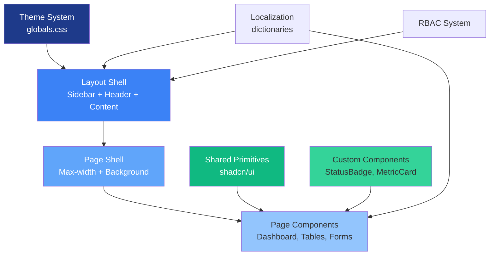
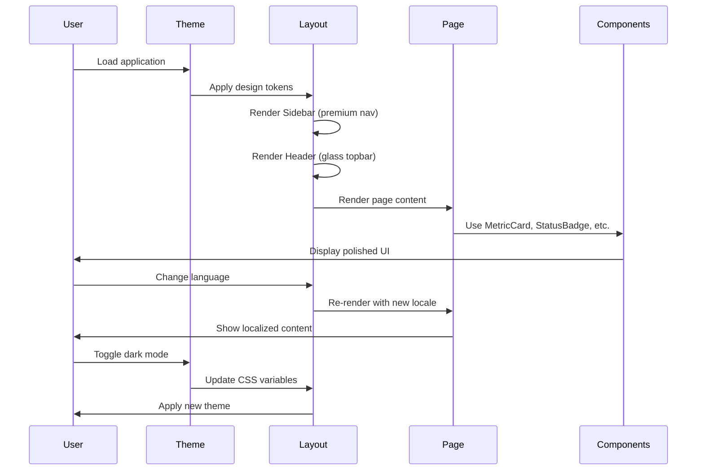

# Design Document: Modern Civic SaaS UI Redesign

## Overview

This design transforms the Hermata Tax and Property Payment Management System from a basic government portal into a world-class, modern SaaS platform. The redesign focuses on creating a premium, calm, clean, and trustworthy visual experience that impresses during project defense while maintaining all existing functionality. The design system draws inspiration from Linear's clarity, Vercel's polish, and modern fintech dashboards, creating a "Modern Civic SaaS" aesthetic that feels professional, data-focused, and elegant.

The redesign addresses critical UI/UX issues: flat sidebar navigation, uninspiring header, empty-looking dashboard, lack of typography hierarchy, generic cards and tables, and absence of visual depth. The solution introduces a comprehensive design system with soft blue-gray backgrounds, translucent white cards with layered shadows, deep royal blue primary colors, emerald success accents, and refined component styling across all 13 critical UI areas.

## Architecture

The UI redesign follows a layered component architecture that separates concerns between layout, shared primitives, and page-specific implementations:



## Main Workflow



## Components and Interfaces

### Component 1: Theme System

**Purpose**: Provides design tokens and CSS variables for the Modern Civic SaaS aesthetic

**Interface**:
```typescript
interface ThemeTokens {
  colors: {
    background: string;      // Soft blue-gray app background
    surface: string;          // White/translucent cards
    primary: string;          // Deep royal blue (#1e3a8a)
    secondary: string;        // Emerald/teal for success
    border: string;           // Soft slate/blue-gray
  };
  shadows: {
    soft: string;             // Subtle layered shadows
    elevated: string;         // Premium card elevation
    glow: string;             // Active state glow
  };
  spacing: {
    sidebarWidth: string;     // 16rem (256px)
    headerHeight: string;     // 3.5rem (56px)
    contentPadding: string;   // 1.5rem (24px)
  };
}
```

**Responsibilities**:
- Define CSS custom properties for light and dark modes
- Provide consistent color palette across all components
- Enable smooth theme transitions
- Support Tailwind CSS 4 integration

### Component 2: Premium Sidebar

**Purpose**: World-class SaaS navigation with gradient active states and premium spacing

**Interface**:
```typescript
interface SidebarProps {
  locale: string;
  dict: Dictionary;
  role: UserRole;
}

interface NavigationItem {
  href: string;
  iconKey: string;
  dictKey: string;
  title: string;
  allowedRoles?: UserRole[];
  permission?: string;
}

interface SidebarState {
  isCollapsed: boolean;
  isMobileOpen: boolean;
}
```

**Responsibilities**:
- Render premium brand block with app name and subtitle
- Display navigation groups (Overview, Management, Revenue, Administration)
- Apply gradient background or elevated pill to active nav items
- Show smooth hover states with transitions
- Support collapsed/mobile behavior
- Filter navigation based on RBAC
- Localize all labels

### Component 3: Polished Header/Topbar

**Purpose**: Premium SaaS topbar with glass effect and elegant controls

**Interface**:
```typescript
interface HeaderProps {
  user: {
    name: string;
    email: string;
    image?: string | null;
    role: string;
  };
  locale: string;
  dict: Dictionary;
}

interface HeaderControls {
  liveSystemBadge: boolean;
  languageSwitcher: boolean;
  themeToggle: boolean;
  userMenu: boolean;
}
```

**Responsibilities**:
- Display page context/breadcrumb on left
- Show Live System badge, language switcher, theme toggle, user avatar on right
- Apply soft glass/sticky feel with backdrop blur
- Render elegant separators between controls
- Maintain consistent height and spacing

### Component 4: Page Header Component

**Purpose**: Shared component for consistent page titles and actions

**Interface**:
```typescript
interface PageHeaderProps {
  title: string;
  description?: string;
  eyebrow?: string;          // Breadcrumb or category
  icon?: React.ElementType;
  primaryAction?: {
    label: string;
    onClick: () => void;
    icon?: React.ElementType;
  };
  secondaryAction?: {
    label: string;
    onClick: () => void;
  };
}
```

**Responsibilities**:
- Render page title with proper typography hierarchy
- Display optional description and eyebrow text
- Show optional icon with gradient tile
- Render primary and secondary action buttons
- Support localized labels

### Component 5: Page Shell Component

**Purpose**: Consistent content wrapper with max-width and beautiful background

**Interface**:
```typescript
interface PageShellProps {
  children: React.ReactNode;
  maxWidth?: 'sm' | 'md' | 'lg' | 'xl' | '2xl' | 'full';
  background?: 'default' | 'gradient' | 'glow';
  padding?: 'sm' | 'md' | 'lg';
}
```

**Responsibilities**:
- Apply max-width constraints where appropriate
- Render beautiful background (subtle gradient or soft radial glow)
- Provide consistent page padding
- Support different layout variations

### Component 6: Metric Card Component

**Purpose**: Dynamic KPI cards for dashboard with premium styling

**Interface**:
```typescript
interface MetricCardProps {
  title: string;
  value: string | number;
  change?: {
    value: number;
    trend: 'up' | 'down' | 'neutral';
  };
  icon?: React.ElementType;
  iconColor?: string;
  description?: string;
}
```

**Responsibilities**:
- Display metric title, value, and optional change indicator
- Show icon with colored background
- Apply premium card styling with soft shadows
- Support trend indicators (up/down arrows)
- Render optional description text

### Component 7: Status Badge Component

**Purpose**: Unified status badges for all entity states

**Interface**:
```typescript
type StatusType = 
  | 'DRAFT' | 'SUBMITTED' | 'UNDER_REVIEW' | 'APPROVED' | 'REJECTED' | 'ARCHIVED'
  | 'PENDING' | 'VERIFIED' | 'CANCELLED' | 'ISSUED' | 'PAID' | 'OVERDUE';

interface StatusBadgeProps {
  status: StatusType;
  locale: string;
  dict: Dictionary;
  size?: 'sm' | 'md' | 'lg';
  showIcon?: boolean;
}

interface StatusConfig {
  label: string;
  color: string;
  backgroundColor: string;
  borderColor: string;
  icon?: React.ElementType;
}
```

**Responsibilities**:
- Map status types to visual configurations
- Render badge with soft background, subtle border, and icon
- Support localized status labels
- Provide consistent styling across all pages
- Support different sizes

### Component 8: Enhanced Table Component

**Purpose**: Premium data tables with better toolbar, hover states, and pagination

**Interface**:
```typescript
interface EnhancedTableProps<T> {
  data: T[];
  columns: ColumnDef<T>[];
  searchPlaceholder?: string;
  filters?: FilterConfig[];
  pageSize?: number;
  emptyState?: React.ReactNode;
  locale: string;
  dict: Dictionary;
}

interface TableToolbar {
  search: boolean;
  filters: boolean;
  customize: boolean;
  pageSize: boolean;
}
```

**Responsibilities**:
- Render premium container card with soft shadows
- Display toolbar with search, filters, customize, and page size controls
- Apply better header style and row hover effects
- Show premium empty state when no data
- Fix pagination display ("Showing 1-10 of 50 items")
- Maintain consistent density

### Component 9: Section Card Component

**Purpose**: Premium form sections with clear visual grouping

**Interface**:
```typescript
interface SectionCardProps {
  title: string;
  description?: string;
  children: React.ReactNode;
  collapsible?: boolean;
  defaultOpen?: boolean;
}
```

**Responsibilities**:
- Group related form fields in premium cards
- Display section title and optional description
- Support collapsible sections
- Apply consistent padding and spacing
- Render with soft shadows and borders

### Component 10: Empty State Component

**Purpose**: Premium feedback for empty data states

**Interface**:
```typescript
interface EmptyStateProps {
  icon?: React.ElementType;
  title: string;
  description?: string;
  action?: {
    label: string;
    onClick: () => void;
  };
}
```

**Responsibilities**:
- Display icon, title, and description
- Show optional call-to-action button
- Apply premium styling with proper spacing
- Support localized labels

### Component 11: Error State Component

**Purpose**: Premium error feedback with recovery actions

**Interface**:
```typescript
interface ErrorStateProps {
  title: string;
  description?: string;
  error?: Error;
  retry?: () => void;
  retryLabel?: string;
}
```

**Responsibilities**:
- Display error icon, title, and description
- Show optional error details
- Render retry button if provided
- Apply premium styling
- Support localized labels

## Data Models

### Model 1: Theme Configuration

```typescript
interface ThemeConfig {
  mode: 'light' | 'dark' | 'system';
  tokens: ThemeTokens;
  customizations?: {
    primaryColor?: string;
    borderRadius?: number;
  };
}
```

**Validation Rules**:
- Mode must be one of: 'light', 'dark', 'system'
- Primary color must be valid hex color if provided
- Border radius must be between 0 and 1 if provided

### Model 2: Navigation Configuration

```typescript
interface NavigationConfig {
  items: NavigationItem[];
  groups?: NavigationGroup[];
  collapsed: boolean;
}

interface NavigationGroup {
  id: string;
  label: string;
  items: NavigationItem[];
}
```

**Validation Rules**:
- Each navigation item must have unique href
- Icon key must exist in icon map
- Dict key must exist in dictionary
- Allowed roles must be valid UserRole values

### Model 3: Dashboard Metrics

```typescript
interface DashboardMetrics {
  totalProperties: MetricData;
  totalAssessments: MetricData;
  totalPayments: MetricData;
  totalRevenue: MetricData;
}

interface MetricData {
  value: number;
  change: number;
  trend: 'up' | 'down' | 'neutral';
  period: string;
}
```

**Validation Rules**:
- Value must be non-negative number
- Change must be number (can be negative)
- Trend must be one of: 'up', 'down', 'neutral'
- Period must be non-empty string

## Key Functions with Formal Specifications

### Function 1: applyTheme()

```typescript
function applyTheme(mode: 'light' | 'dark' | 'system'): void
```

**Preconditions:**
- `mode` is one of 'light', 'dark', or 'system'
- Document root element exists

**Postconditions:**
- CSS custom properties are updated to match selected mode
- If mode is 'system', theme matches OS preference
- Theme change is persisted to localStorage
- All components re-render with new theme

**Loop Invariants:** N/A

### Function 2: filterNavigationByRole()

```typescript
function filterNavigationByRole(
  items: NavigationItem[],
  role: UserRole
): NavigationItem[]
```

**Preconditions:**
- `items` is non-empty array of NavigationItem
- `role` is valid UserRole

**Postconditions:**
- Returns filtered array containing only items user can access
- Items without role restrictions are always included
- Items with role restrictions are included only if user role matches
- Items with permission restrictions are included only if user has permission
- Original array is not mutated

**Loop Invariants:**
- All previously checked items remain valid
- Filter criteria remain consistent throughout iteration

### Function 3: calculateMetricChange()

```typescript
function calculateMetricChange(
  current: number,
  previous: number
): { value: number; trend: 'up' | 'down' | 'neutral' }
```

**Preconditions:**
- `current` is non-negative number
- `previous` is non-negative number

**Postconditions:**
- Returns object with percentage change value and trend
- If previous is 0, returns { value: 0, trend: 'neutral' }
- Trend is 'up' if change > 0
- Trend is 'down' if change < 0
- Trend is 'neutral' if change === 0
- Value is rounded to 1 decimal place

**Loop Invariants:** N/A

### Function 4: formatStatusBadge()

```typescript
function formatStatusBadge(
  status: StatusType,
  locale: string,
  dict: Dictionary
): StatusConfig
```

**Preconditions:**
- `status` is valid StatusType
- `locale` is non-empty string
- `dict` contains status translations

**Postconditions:**
- Returns StatusConfig with label, colors, and icon
- Label is localized based on locale
- Colors match status type (e.g., green for APPROVED, red for REJECTED)
- Icon is appropriate for status type
- If translation missing, falls back to English

**Loop Invariants:** N/A

## Algorithmic Pseudocode

### Main Theme Application Algorithm

```typescript
// Algorithm: Apply theme to application
// Input: mode ('light' | 'dark' | 'system')
// Output: void (side effect: updates DOM and localStorage)

function applyTheme(mode: 'light' | 'dark' | 'system'): void {
  // Step 1: Resolve actual theme if system mode
  let resolvedMode = mode;
  if (mode === 'system') {
    resolvedMode = window.matchMedia('(prefers-color-scheme: dark)').matches 
      ? 'dark' 
      : 'light';
  }
  
  // Step 2: Update document class
  const root = document.documentElement;
  root.classList.remove('light', 'dark');
  root.classList.add(resolvedMode);
  
  // Step 3: Persist preference
  localStorage.setItem('theme', mode);
  
  // Step 4: Dispatch theme change event
  window.dispatchEvent(new CustomEvent('themechange', { 
    detail: { mode: resolvedMode } 
  }));
}
```

**Preconditions:**
- mode is one of 'light', 'dark', or 'system'
- window and document objects are available
- localStorage is accessible

**Postconditions:**
- Document root has correct theme class
- Theme preference is saved to localStorage
- Theme change event is dispatched
- All CSS variables are updated via class change

### Navigation Filtering Algorithm

```typescript
// Algorithm: Filter navigation items by user role and permissions
// Input: items (NavigationItem[]), role (UserRole)
// Output: filtered NavigationItem[]

function filterNavigationByRole(
  items: NavigationItem[],
  role: UserRole
): NavigationItem[] {
  const filtered: NavigationItem[] = [];
  
  for (const item of items) {
    // Check role-based access
    if (item.allowedRoles && !item.allowedRoles.includes(role)) {
      continue; // Skip this item
    }
    
    // Check permission-based access
    if (item.permission && !hasPermission(role, item.permission)) {
      continue; // Skip this item
    }
    
    // Item passed all checks
    filtered.push(item);
  }
  
  return filtered;
}
```

**Preconditions:**
- items is array of NavigationItem (may be empty)
- role is valid UserRole
- hasPermission function is available

**Postconditions:**
- Returns array of items user can access
- Items without restrictions are always included
- Items with restrictions are included only if user qualifies
- Original array is not modified
- Order of items is preserved

**Loop Invariants:**
- All items in filtered array have passed access checks
- No items are added that fail role or permission checks

### Metric Change Calculation Algorithm

```typescript
// Algorithm: Calculate percentage change and trend
// Input: current (number), previous (number)
// Output: { value: number, trend: 'up' | 'down' | 'neutral' }

function calculateMetricChange(
  current: number,
  previous: number
): { value: number; trend: 'up' | 'down' | 'neutral' } {
  // Handle edge case: no previous data
  if (previous === 0) {
    return { value: 0, trend: 'neutral' };
  }
  
  // Calculate percentage change
  const change = ((current - previous) / previous) * 100;
  const roundedChange = Math.round(change * 10) / 10; // Round to 1 decimal
  
  // Determine trend
  let trend: 'up' | 'down' | 'neutral';
  if (roundedChange > 0) {
    trend = 'up';
  } else if (roundedChange < 0) {
    trend = 'down';
  } else {
    trend = 'neutral';
  }
  
  return { value: roundedChange, trend };
}
```

**Preconditions:**
- current is non-negative number
- previous is non-negative number

**Postconditions:**
- Returns object with value and trend
- value is percentage change rounded to 1 decimal
- trend correctly reflects direction of change
- If previous is 0, returns neutral with 0 value
- No division by zero errors

### Status Badge Formatting Algorithm

```typescript
// Algorithm: Format status badge with localized label and styling
// Input: status (StatusType), locale (string), dict (Dictionary)
// Output: StatusConfig

function formatStatusBadge(
  status: StatusType,
  locale: string,
  dict: Dictionary
): StatusConfig {
  // Step 1: Get localized label
  const labelKey = `status.${status.toLowerCase()}`;
  const label = dict.common?.[labelKey] || status;
  
  // Step 2: Map status to colors and icon
  const statusMap: Record<StatusType, Omit<StatusConfig, 'label'>> = {
    DRAFT: {
      color: '#64748b',
      backgroundColor: '#f1f5f9',
      borderColor: '#cbd5e1',
      icon: FileText
    },
    APPROVED: {
      color: '#059669',
      backgroundColor: '#d1fae5',
      borderColor: '#6ee7b7',
      icon: CheckCircle
    },
    REJECTED: {
      color: '#dc2626',
      backgroundColor: '#fee2e2',
      borderColor: '#fca5a5',
      icon: XCircle
    },
    // ... other status mappings
  };
  
  // Step 3: Get config for status
  const config = statusMap[status];
  
  // Step 4: Return complete StatusConfig
  return {
    label,
    ...config
  };
}
```

**Preconditions:**
- status is valid StatusType
- locale is non-empty string
- dict is valid Dictionary object

**Postconditions:**
- Returns StatusConfig with all required fields
- Label is localized if translation exists
- Colors and icon match status type
- If status not in map, returns default config
- No errors thrown for missing translations

## Example Usage

### Example 1: Applying Theme

```typescript
// User toggles theme
import { applyTheme } from '@/lib/theme';

// Apply dark mode
applyTheme('dark');

// Apply system preference
applyTheme('system');

// Listen for theme changes
window.addEventListener('themechange', (event) => {
  console.log('Theme changed to:', event.detail.mode);
});
```

### Example 2: Rendering Premium Sidebar

```typescript
import { AppSidebar } from '@/components/layout/app-sidebar';

export default function DashboardLayout({ children }) {
  const session = await auth();
  const dict = await getDictionary(locale);
  
  return (
    <div className="flex h-screen">
      <AppSidebar 
        locale={locale}
        dict={dict}
        role={session.user.role}
      />
      <main className="flex-1 overflow-auto">
        {children}
      </main>
    </div>
  );
}
```

### Example 3: Using Metric Cards on Dashboard

```typescript
import { MetricCard } from '@/components/ui/metric-card';
import { Home, Calculator, CreditCard, DollarSign } from 'lucide-react';

export default function Dashboard() {
  const metrics = await fetchDashboardMetrics();
  
  return (
    <div className="grid gap-4 md:grid-cols-2 lg:grid-cols-4">
      <MetricCard
        title="Total Properties"
        value={metrics.totalProperties.value}
        change={{
          value: metrics.totalProperties.change,
          trend: metrics.totalProperties.trend
        }}
        icon={Home}
        iconColor="text-blue-600"
      />
      <MetricCard
        title="Total Assessments"
        value={metrics.totalAssessments.value}
        change={{
          value: metrics.totalAssessments.change,
          trend: metrics.totalAssessments.trend
        }}
        icon={Calculator}
        iconColor="text-emerald-600"
      />
      {/* More metric cards... */}
    </div>
  );
}
```

### Example 4: Using Status Badges

```typescript
import { StatusBadge } from '@/components/ui/status-badge';

export function PropertyList({ properties, locale, dict }) {
  return (
    <table>
      <tbody>
        {properties.map((property) => (
          <tr key={property.id}>
            <td>{property.name}</td>
            <td>
              <StatusBadge
                status={property.status}
                locale={locale}
                dict={dict}
                showIcon
              />
            </td>
          </tr>
        ))}
      </tbody>
    </table>
  );
}
```

### Example 5: Using Enhanced Table

```typescript
import { EnhancedTable } from '@/components/table/enhanced-table';

export function PropertiesPage({ locale, dict }) {
  const columns = [
    { accessorKey: 'id', header: dict.common.id },
    { accessorKey: 'name', header: dict.common.name },
    { accessorKey: 'owner', header: dict.common.owner },
    { accessorKey: 'status', header: dict.common.status }
  ];
  
  return (
    <EnhancedTable
      data={properties}
      columns={columns}
      searchPlaceholder={dict.common.searchProperties}
      locale={locale}
      dict={dict}
      emptyState={
        <EmptyState
          icon={Home}
          title={dict.common.noProperties}
          description={dict.common.noPropertiesDescription}
        />
      }
    />
  );
}
```

## Error Handling

### Error Scenario 1: Theme Application Failure

**Condition**: localStorage is not available or document root is missing
**Response**: Fall back to light mode without persisting preference
**Recovery**: Log error and continue with default theme

### Error Scenario 2: Missing Translation

**Condition**: Dictionary key does not exist for current locale
**Response**: Fall back to English label or raw status value
**Recovery**: Display untranslated text rather than breaking UI

### Error Scenario 3: Invalid Navigation Configuration

**Condition**: Navigation item has invalid icon key or missing href
**Response**: Skip invalid item and log warning
**Recovery**: Continue rendering valid navigation items

### Error Scenario 4: Metric Calculation Error

**Condition**: Invalid numeric values passed to calculateMetricChange
**Response**: Return neutral trend with 0 value
**Recovery**: Display metric without change indicator

## Testing Strategy

### Unit Testing Approach

Focus on testing individual functions and components in isolation:

**Theme System Tests**:
- Test applyTheme with each mode ('light', 'dark', 'system')
- Verify CSS classes are applied correctly
- Test localStorage persistence
- Test system preference detection

**Navigation Tests**:
- Test filterNavigationByRole with different roles
- Verify role-based filtering works correctly
- Verify permission-based filtering works correctly
- Test with empty navigation items array

**Metric Tests**:
- Test calculateMetricChange with various inputs
- Test edge cases (previous = 0, negative changes)
- Verify rounding to 1 decimal place
- Test trend determination logic

**Status Badge Tests**:
- Test formatStatusBadge with all status types
- Verify localization fallback works
- Test with missing dictionary keys
- Verify color and icon mapping

### Property-Based Testing Approach

Property-based testing is not applicable for this UI redesign project as it primarily involves:
- Visual styling and CSS changes
- Component rendering and layout
- User interface interactions
- Localization and theming

These are best tested through:
- Visual regression tests (screenshot comparisons)
- Integration tests (user interactions)
- Manual QA (visual inspection)

### Integration Testing Approach

Test component interactions and full page rendering:

**Layout Integration Tests**:
- Test sidebar + header + content shell rendering together
- Verify theme changes propagate to all components
- Test language switching updates all labels
- Verify RBAC filtering works in full layout

**Dashboard Integration Tests**:
- Test metric cards render with real data
- Verify charts display correctly
- Test empty states when no data
- Verify responsive layout on different screen sizes

**Table Integration Tests**:
- Test search, filter, and pagination together
- Verify sorting works correctly
- Test empty state rendering
- Verify row actions work correctly

**Form Integration Tests**:
- Test section cards with form fields
- Verify validation displays correctly
- Test form submission flow
- Verify localized error messages

## Performance Considerations

**CSS Custom Properties**: Using CSS variables for theming enables instant theme switching without re-rendering React components

**Component Memoization**: Memoize expensive components like tables and charts to prevent unnecessary re-renders

**Lazy Loading**: Lazy load heavy components (charts, complex forms) to improve initial page load

**Image Optimization**: Use Next.js Image component for optimized loading of user avatars and icons

**Bundle Size**: Keep component library imports tree-shakeable to minimize bundle size

**Animation Performance**: Use CSS transforms and opacity for animations (GPU-accelerated) rather than layout properties

## Security Considerations

**RBAC Enforcement**: Navigation filtering happens on both client and server to prevent unauthorized access

**XSS Prevention**: All user-generated content is sanitized before rendering

**Theme Persistence**: localStorage is used safely without storing sensitive data

**API Security**: All data fetching uses authenticated API routes with proper authorization checks

## Dependencies

**Core Framework**:
- Next.js 16.2.6
- React 19.2.6
- TypeScript 5

**UI Libraries**:
- Tailwind CSS 4
- shadcn/ui (Radix UI primitives)
- lucide-react (icons)
- framer-motion (animations)

**Data Visualization**:
- Recharts 3.8.1

**Form Handling**:
- react-hook-form 7.54.2
- zod 3.24.1

**Utilities**:
- clsx / tailwind-merge (className utilities)
- date-fns (date formatting)
- next-themes (theme management)

**Package Manager**:
- PNPM (required)
